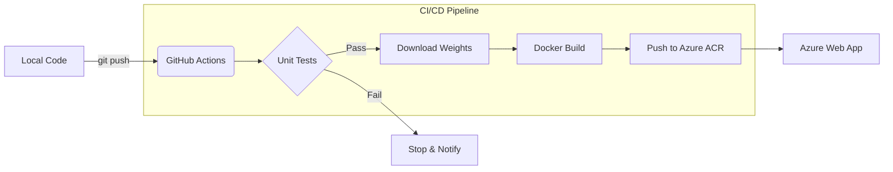

# 🩻 Chest X-Ray Abnormality Detection (MLOps Pipeline)


## 🚀 Live Demo

**Try the AI Doctor here:** 👉 **[https://chest-xray-mlops-vfsrzjy8svztydjkzenha9.streamlit.app](https://chest-xray-mlops-vfsrzjy8svztydjkzenha9.streamlit.app)**

---

## 📖 Project Overview

This project is a full-stack **MLOps implementation** of a medical diagnostic tool. It uses Deep Learning to analyze Chest X-Rays and detect abnormalities (Pneumonia, etc.).

The system is designed with a **Microservices Architecture**:

1.  **The Brain (Backend):** A FastAPI server hosted on **Microsoft Azure**, running a DenseNet121 model.
2.  **The Face (Frontend):** A Streamlit web interface for users to upload images and view results.
3.  **The Explainability:** Integrated **Grad-CAM** (Gradient-weighted Class Activation Mapping) to visualize _why_ the model made its decision.
    test:

---

## ✨ Key Features

- **Explainable AI (XAI):** Returns a color-coded Grad-CAM heatmap alongside the prediction probability, crucial for medical domains where "black-box" models are insufficient.
- **Decoupled Microservice Design:** The Streamlit frontend and FastAPI backend operate independently, allowing the backend compute to scale without affecting the user interface.
- **Production Security:** Actively mitigated Critical/High CVEs (Common Vulnerabilities and Exposures) by auditing Docker image layers and upgrading base runtimes.

## 🏗️ System Architecture

| Component     | Technology            | Description                                                     |
| :------------ | :-------------------- | :-------------------------------------------------------------- |
| **Model**     | PyTorch (DenseNet121) | Pre-trained on ImageNet, fine-tuned on NIH Chest X-Ray dataset. |
| **API**       | FastAPI               | Handles image processing, inference, and Grad-CAM generation.   |
| **Container** | Docker                | Containerizes the environment for consistent deployment.        |
| **CI/CD**     | GitHub Actions        | Automatically builds and deploys to Azure on every push.        |
| **Cloud**     | Azure Web App         | Hosts the serverless backend.                                   |
| **Frontend**  | Streamlit             | Provides a user-friendly GUI for real-time inference.           |

---

## 🧠 AI & Explainability

This project goes beyond simple prediction by implementing **Grad-CAM**.

- **Problem:** Deep Learning models are often "Black Boxes."
- **Solution:** We extract gradients from the final convolutional layer to generate a heatmap.
- **Result:** The user sees exactly which regions of the lungs triggered the diagnosis.

---




🚀 MLOps & Automation Features
Continuous Integration (CI): Automated testing using pytest to verify API health and model inference before every deployment.

Continuous Deployment (CD): Fully automated containerized workflow that builds Docker images and deploys to Azure App Service.

Artifact Management: Decoupled large model weights (27.1 MB) from source code using GitHub Releases, ensuring a lightweight and efficient repository.

Security & Environment: Containerized with Docker to ensure environment parity between development and production.

## 🛠️ How to Run Locally

1. **Clone the Repo**
   ```bash
   git clone [https://github.com/DRAGOX7/chest-xray-mlops.git](https://github.com/DRAGOX7/chest-xray-mlops.git)
   cd chest-xray-mlops
   ```
